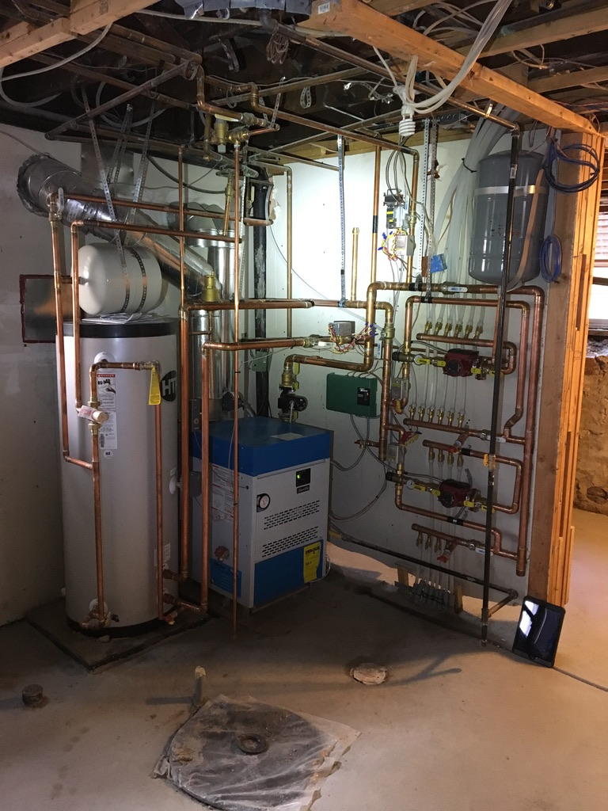
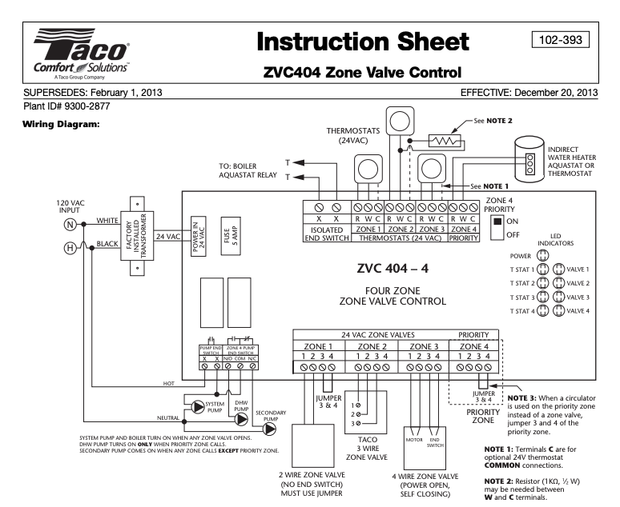
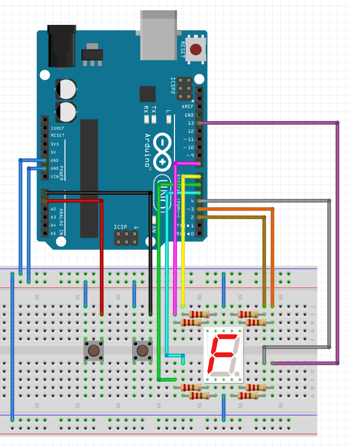
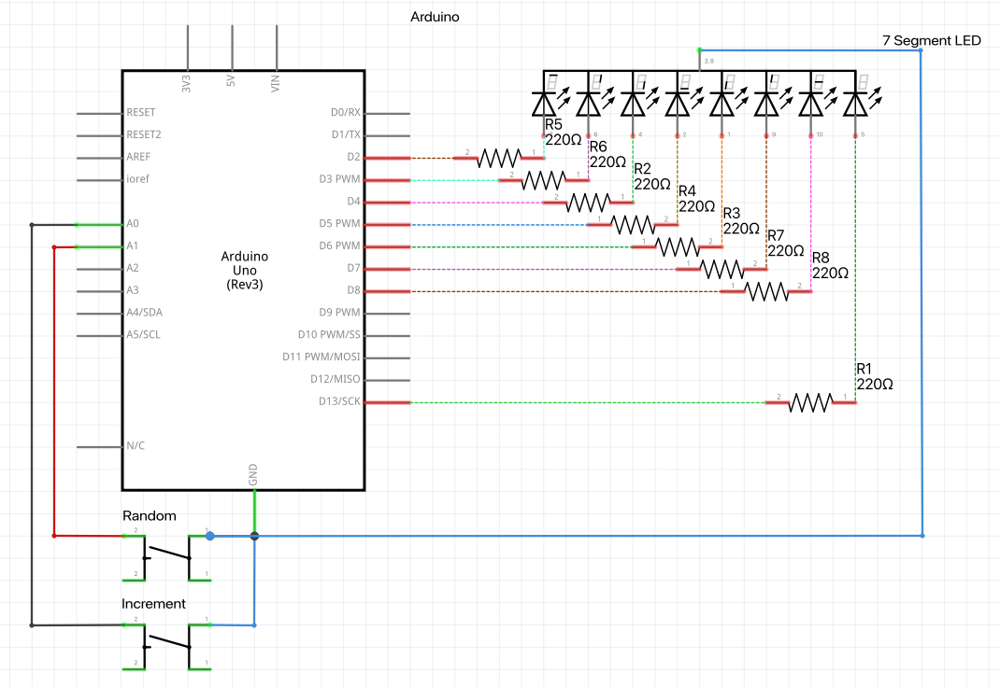

# buttonLED

This is the first circuit/ code combo I've designed and built on my own.  I have been messing around with an [arduino](https://www.arduino.cc/) uno for a couple of days now and I wanted to see what I could do with one.  A while back, I picked up a starter kit that came with an uno along with a bunch of random parts that you can use to build different sorts of projects.  Upon seeing the seven segment LED component I knew what my first project after general tinkering was going to be.  

<br>

I set out to build a circuit that upon pressing one button it will count 0 - 9 on the LED.  When the user presses another button a random number will appear.


*the finished prototype in action*
<hr>

<br>

## Background

I have a decent amount of experience with 24v control circuits from my days as an HVAC tech.  The control wiring was always one of the most interesting aspects of the job to me.  There is something about setting up the logic of the circuitry that captured my imagination.  I particularly enjoyed wiring all the limit switches, zone valves, end switches, gas valves, and thermostats that ran the boilers I used to service and install.  On full installs, where we would replace all the existing old components with new ones, I would love to just sit there on my stool with the spools of wire, a pair of wire strippers and all the wiring diagrams for the system. Whenever I set up the control wiring of a system I would let my mind drift into the world of switches, pathways and loads that I would layout for the electricity to flow in order for me to automate the heating or cooling of my customers' home or building. 



*boiler that a colleague and I built for a customer*

<hr>

<br>

On jobs that had more of a complicated setup we would typically use a [Taco Zone Valve Controller](https://www.tacocomfort.com/product/zone-valve-controls/) to help simplify the circuits we would need to build.  While setting up the thermostats and pumps I used to think about the logic inside of these controllers.  Now, as I mess with the arduino I am starting to understand how the logic actually may have worked.



*taco diagram*
<hr>

<br>

That was a fun trip down memory lane, back to the circuit at hand

<br>
<br>

## Wiring Diagram

For the 7 segment LED circuit, I designed it in a stream of consciousness sort of way.  I started out with a bit of research into how the 7 segment LED works and how LEDs work in general.  I first started with the increment button, wired the 7 segment LED and then added the random button later.  Before I wrote any code I made sure I knew that my wiring was correct by applying 5v directly to each of the LED circuits within the 7 segment LED.  Once that was sorted I moved on to the code itself. I chose to wire the decimal point to the 13th pin in order to tap into the arduino's built in LED as well.  



<br>
<br>

### Schematic



<hr>
<br>
<br>

## Code

For the 7 segment LED I declared a variable for each of the pins that would be connected to each corresponding LED segment.  I had fun building the logic behind lighting each of the segments of the LED.  Here is the code:

```c++
void writeNumber() {
  // Display the corresponding number on the 7-segment display
  digitalWrite(segA, number == 0 || number == 2 || number == 3 || number == 5 || number == 6 || number == 7 || number == 8 || number == 9);
  digitalWrite(segB, number == 0 || number == 1 || number == 2 || number == 3 || number == 4 || number == 7 || number == 8 || number == 9);
  digitalWrite(segC, number == 0 || number == 1 || number == 3 || number == 4 || number == 5 || number == 6 || number == 7 || number == 8 || number == 9);
  digitalWrite(segD, number == 0 || number == 2 || number == 3 || number == 5 || number == 6 || number == 8 || number == 9);
  digitalWrite(segE, number == 0 || number == 2 || number == 6 || number == 8);
  digitalWrite(segF, number == 0 || number == 4 || number == 5 || number == 6 || number == 8 || number == 9);
  digitalWrite(segG, number == 2 || number == 3 || number == 4 || number == 5 || number == 6 || number == 8 || number == 9);
}
```

<br>

As the `number` variable changes, different segments of the component are given power.  I manually "drew" each of the segments based on how each number looks in relation to the map below.  It took a few trial and error rounds and the end results were so satisfying!  To be able to see the LEDs light up and correctly display the number.


<br>

One aspect of this code that I wasn't a big fan of was the way that the random numbers are generated.  I am using a built in method `random()` this returns a pseudo random number.  While I am not looking for something that is truly random, I am looking for something that doesn't repeat its' "random" numbers every time the code is reset.  Each time the user resets the program and uses the random number button here is the repeated order: 8, 0, 2, 5, 7, 4, 6, 2, 0, 2, 3 and so on until you are bored.  This brings me back to a CD player I once had that would play the songs in the same random order whenever I put in shuffle mode. 

<hr>

<br>
<br>

## Looking Forward

This was a very fun project to tackle and it also showed that 7 segment LEDs can eat up a lot of the uno's pins (I used 8). I am planning on revisiting this project and using a library that enables the use of only a few wires to control many LEDs.  I haven't decided on which one to use yet and am going to do a bit of research into the different ones out there.  

I am also planning on researching how to make the random numbers more random. 
